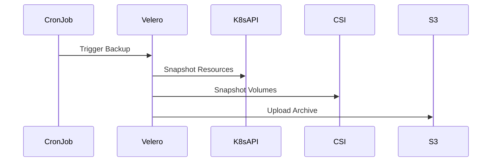

# Architecture: Kubernetes Disaster Recovery
> Maturity: Lab / Reference Implementation

## System Diagram
The following Mermaid.js sequence diagram maps the core workflow and interactions:

## How Velero Works
Velero consists of two components:
1. **A command-line client (CLI)** that runs locally.
2. **A server deployment** running within the Kubernetes cluster.

When a backup is triggered, the Velero controller queries the Kubernetes API server for all objects (or filtered by namespace/label). It serializes these objects into JSON and uploads them to a configured object storage bucket (S3, Azure Blob, GCS).

Simultaneously, if `snapshotVolumes` is enabled, Velero communicates with the cloud provider's API (via plugins) to trigger underlying disk snapshots of the Persistent Volumes attached to the pods.

## Multi-Cluster Restore Strategy
Because Velero backs up Kubernetes API YAML rather than taking an `etcd` database snapshot, it is incredibly flexible. You can:
- Back up from an on-prem cluster and restore to AWS EKS.
- Back up from Kubernetes v1.28 and restore to v1.30 (in most cases).
- Restore a specific namespace to a different cluster for debugging.

This API-level backup makes it vastly superior to node-level or etcd-level backups in modern cloud-native architectures.
